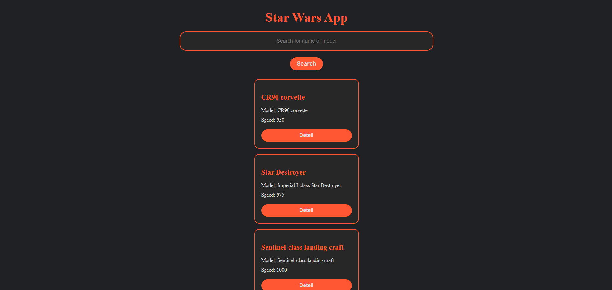
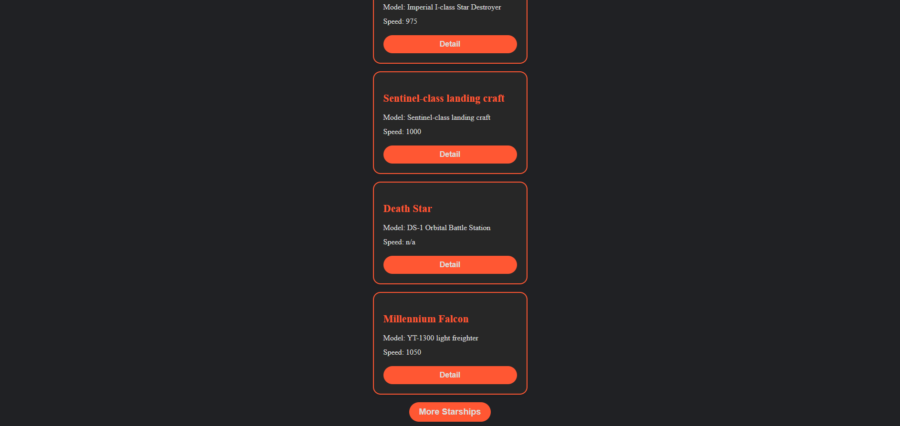
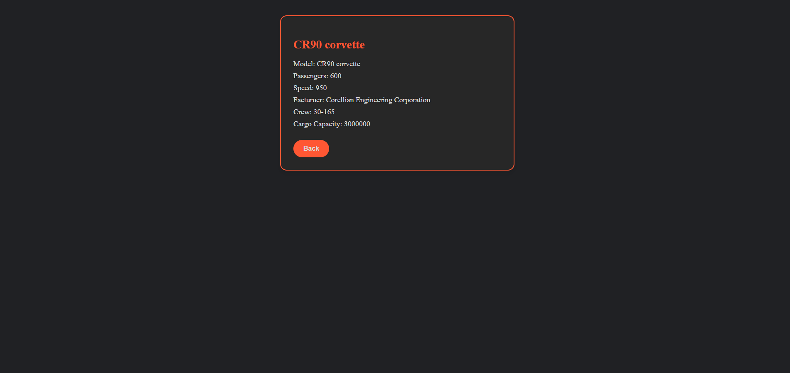

# Patika+ Frontend Bootcamp Hafta-12 (Star Wars App)

Bu proje, Star Wars evrenindeki uzay gemilerini görüntüleyen bir React uygulamasıdır.

## Özellikler

- Star Wars uzay gemilerinin listesini görüntüleme
- Uzay gemisi detaylarını inceleme
- İsim veya modele göre arama yapabilme
- Daha fazla uzay gemisi yükleyebilme

## Kullanılan Teknolojiler

- React
- React Router
- SWAPI (Star Wars API)
- Vite

## Kurulum

1. Bu repo'yu bilgisayarınıza indirin:
    ```bash
    git clone https://github.com/emreykaya/w12-star-wars-app.git
    ```

2. Projeye gidin:
    ```bash
    cd w12-star-wars-app
    ```

3. Gerekli bağımlılıkları yükleyin:
    ```bash
    npm install
    ```

4. Uygulamayı başlatın:
    ```bash
    npm start
    ```

Uygulama, [http://localhost:3000](http://localhost:3000) adresinde çalışacaktır.

## Ekran Görüntüleri





